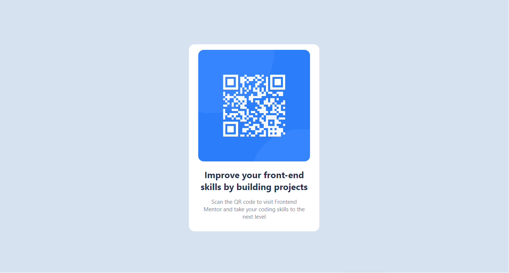
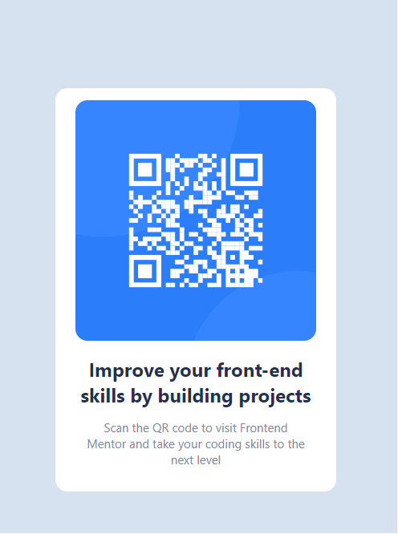

# Frontend Mentor - QR code component solution

Esta é a minha solução para o desafio do Frontend Mentor  [QR code component challenge on Frontend Mentor](https://www.frontendmentor.io/challenges/qr-code-component-iux_sIO_H). Frontend Mentor challenges help you improve your coding skills by building realistic projects. 

### Screenshot





### Built with

- HTML5 markup
- CSS 
- Flexbox


```html
<h1>Este codigo foi interessante pois, eu estava a tentar utilizar o css para alinhar... enquanto era uma questao de dois paragrafos.</h1>

  <div class="grid-item" id="paragrafo">

            <p> Scan the QR code to visit Frontend</p>
            <p>Mentor and take your coding skills to the next level</p> 

        </div>
```